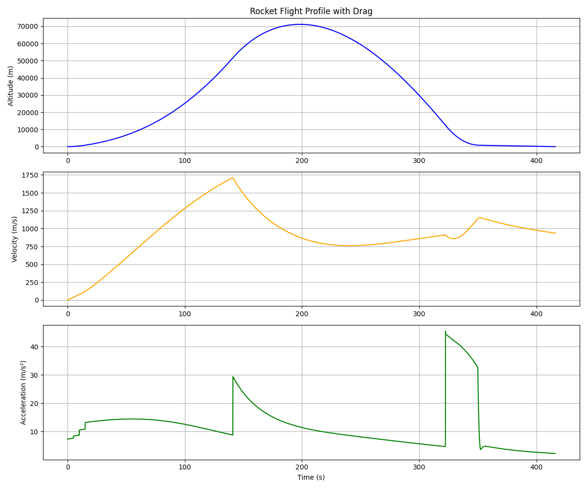

# 🚀 Rocket Landing Simulator

A 2D physics-based simulator for vertical rocket landing using Python and matplotlib.  
Simulates liftoff, drag, fuel burn, max deceleration, and an autonomous landing burn sequence.

## 📌 Features

- Throttle-based ascent with angle control
- Realistic mass reduction from fuel consumption
- Atmospheric drag modeled with drag coefficient
- PID-style landing burn using proportional control (Kp)
- Triggered soft-landing based on descent rate and stopping distance
- Detailed plots: Altitude, Velocity, Acceleration, and Mass over time

## 📊 Example Output

  
_3-panel plot showing altitude, velocity, and acceleration over time_

## 🧮 Technologies

- Python 3.x
- NumPy
- Matplotlib

## 🚦 Usage

1. Clone or download this repository:
    ```bash
    git clone https://github.com/Crose2020/rocket-landing-simulator.git
    cd rocket-landing-simulator
    ```

2. Install requirements (if needed):
    ```bash
    pip install matplotlib numpy
    ```

3. Run the simulator:
    ```bash
    python simple_thrust_sim.py
    ```

## ✏️ Author

**Cade Rose**  
Email: [cade.rose13@gmail.com](mailto:cade.rose13@gmail.com)  
GitHub: [github.com/Crose2020](https://github.com/Crose2020)

---

